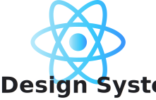

<div align="center">
  
</div>

##


<div align="center">
       <a href="https://www.figma.com/file/Brf0ceGz5219YzgkG5JjyW/Ignite-Lab-Design-System?node-id=1%3A175" target="_blank" rel="noreferrer">  </a> 
         <a href="https://reactjs.org/" target="_blank" rel="noreferrer">  </a>
        <a href="https://www.typescriptlang.org/" target="_blank" rel="noreferrer">  </a>
        <a href="https://www.heroku.com/" target="_blank" rel="noreferrer">  </a> 
        <a href="https://storybook.js.org/docs/react/get-started/introduction" target="_blank" rel="noreferrer">  </a> 

<br>
<br>
<br>
</div>

Este projeto foi desenvolvido durante o Ignite Lab 3 da RocketSeat.


A partir da criação da identidade visual do  *Design System* utilizando **Figma**, a aplicação foi iniciada utilizando **ViteJS**, com a escolha do Framework **React** utilizando **TypeScript** como variante.
Foram desenvolvidos os componentes e suas documentações utilizando o **Storybook**.
Para a camada de estilo foi utilizado **Tailwindcss**.

A página de Login foi construída e o processo de deploy do <i>Storybook</i> foi automatizado. Por fim, alguns testes nessa página foram criados simulando a iteração do usuário.</div>

Pode ser acessado pelo link:
https://mayaragao.github.io/Design-System/

A identidade visual desenvolvida pode ser acessada pelo seguinte link: [Figma Design System](https://www.figma.com/file/Brf0ceGz5219YzgkG5JjyW/Ignite-Lab-Design-System?node-id=1%3A3)

##

### Instalação

Para rodar localmente, é necessário instalar todas as dependencias do projeto. Rode o seguinte comando no terminal no diretório do projeto:

```
git clone https://github.com/mayaragao/Design-System.git
cd Design-System
npm install
```

**Observação**: Se você ainda não possui o **Node.js** instalado na sua máquina local, instale e depois rode o comando acima. 

##

### Acesso a API

Após instalar todos os pacotes necessários, para abrir a aplicação na sua máquina local, rode o comando:

```
npm run dev
```

Para abrir a o Storybook na sua máquina , rode o comando:

```
npm run storybook
```

